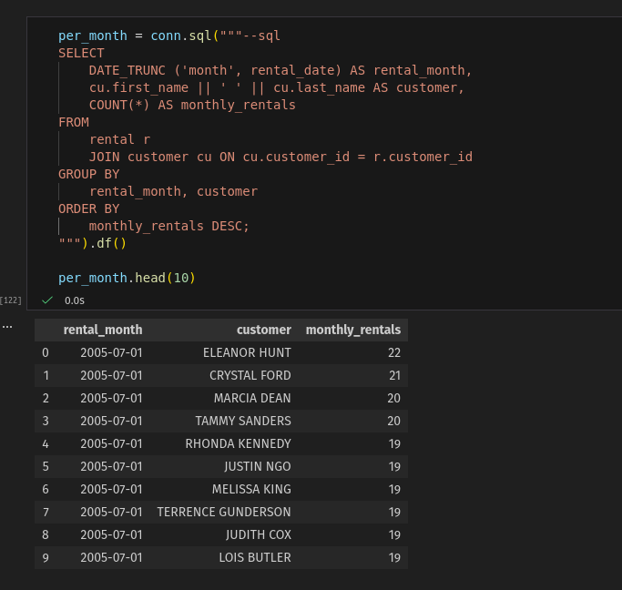
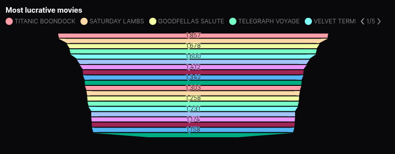
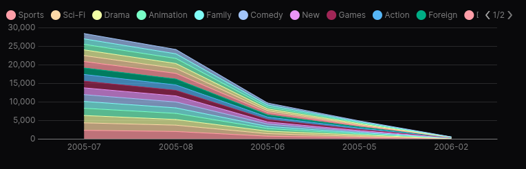
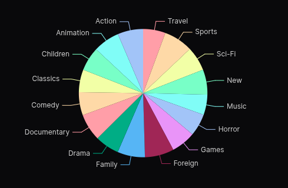

# Sakila SQL Lab - End-to-End Analysis and Visual Reporting

This project demonstrates a complete analytical workflow using the Sakila database: data ingestion from `SQLite` into `DuckDB`, exploratory SQL analysis in `Jupyter`, and a final visual dashboard built with `Evidence`. The objective is to show how a small but realistic dataset can be transformed into structured insights through a modern local analytics stack.

---

## Project purpose

The <b>Sakila</b> database models a film-rental business. This project uses it to explore questions such as:

- which films drive most rental activity
- how categories differ in performance
- how rentals change over time
- how payments vary across films and categories
- how inventory, rentals and payments behave as one analytical flow

The focus is on <i>clear SQL</i>, transparent modelling and reproducibility.

---

## Tech stack

- `DuckDB` for analytical storage and querying
- `SQLite` as the raw source database
- `dlt` for ingestion and schema setup
- `Python` for pipeline orchestration
- `Jupyter notebooks` for exploration and validation
- `Evidence.dev` for dashboarding and presentation

---

## Workflow overview

### 1. Data ingestion (SQLite to DuckDB)

Download sqlite-sakila.db from here: <a href="https://www.kaggle.com/datasets/atanaskanev/sqlite-sakila-sample-database">Sakila on Kaggle</a>

A Python script ingests the SQLite source database into DuckDB under a staging schema, creating a reproducible foundation for the analysis.

Command:

``` python scripts/ingest_sakila.py ```

Output is written to <i>data/sakila.duckdb.</i>

### 2. SQL exploration and analysis

Jupyter notebooks are used to:

- inspect relationships between core tables
- test and refine `SQL queries`
- analyse rental patterns and category behaviour
- build monthly summaries and time-based metrics
- explore payment distributions

<p align="center">
  

### 3. Visual reporting with Evidence

Evidence connects directly to `DuckDB` and presents the results through a clean, minimal dashboard. Included sections highlight:

- top rented films
- category performance
- rental activity across months
- payment distributions
- combined analyses spanning film, inventory, rental and payment tables

<p align="center">
  
</p>

---

## Key insights

Typical findings include:

<p align="center">
    
    </br>
    
</p>

---

## Repository structure

```
.
├── data/          # Source SQLite file and generated DuckDB database
├── scripts/       # Ingestion pipeline
├── notebooks/     # SQL exploration and analysis
└── evidence/      # Visual dashboard
```

---